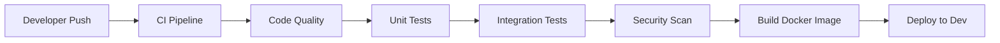
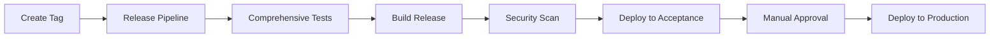
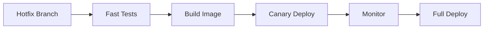

# CI/CD Pipeline Documentation

This directory contains the complete CI/CD pipeline configuration for the Flask API Template project. The pipeline is designed to provide automated testing, building, deployment, and monitoring capabilities across multiple environments.

## 🚀 Overview

The CI/CD pipeline consists of several interconnected workflows that handle different aspects of the software delivery lifecycle:

- **Continuous Integration (CI)**: Automated testing, code quality checks, and security scanning
- **Continuous Deployment (CD)**: Automated deployment to multiple environments with approval gates
- **Security & Monitoring**: Ongoing security scanning and dependency management
- **Environment Management**: Manual operations for deployment management
- **Pipeline Testing**: Automated testing of the CI/CD pipeline itself

## 📁 Workflow Files

### Core Workflows

| Workflow | File | Trigger | Purpose |
|----------|------|---------|---------|
| **Continuous Integration** | `ci.yml` | Push, PR | Code quality, testing, security scanning |
| **Continuous Deployment** | `cd.yml` | Push to main, tags | Multi-environment deployment |
| **Security Scanning** | `security.yml` | Schedule, manual | Security vulnerability scanning |
| **Dependency Updates** | `dependency-update.yml` | Schedule, manual | Automated dependency updates |
| **Release Management** | `release.yml` | Tags, manual | Production releases |
| **Hotfix Deployment** | `hotfix.yml` | Hotfix branches | Emergency deployments |

### Management Workflows

| Workflow | File | Trigger | Purpose |
|----------|------|---------|---------|
| **Environment Management** | `environment-management.yml` | Manual | Environment operations |
| **Pipeline Testing** | `pipeline-test.yml` | Schedule, manual | Pipeline validation |
| **Issue Management** | `issue-management.yml` | Issues, schedule | Automated issue handling |

### Configuration Files

| File | Purpose |
|------|---------|
| `dependabot.yml` | Automated dependency updates |
| `deployment-config.yml` | Environment-specific deployment settings |

## 🔄 CI/CD Flow

### 1. Development Flow



### 2. Release Flow



### 3. Hotfix Flow



## 🌍 Environments

The pipeline supports multiple environments with different characteristics:

### Development
- **URL**: `https://dev-api.example.com`
- **Auto-deploy**: ✅ Yes (on main branch)
- **Approval**: Not required
- **Purpose**: Development and testing

### Acceptance
- **URL**: `https://acc-api.example.com`
- **Auto-deploy**: ✅ Yes (after dev success)
- **Approval**: 1 reviewer required
- **Purpose**: User acceptance testing

### Production
- **URL**: `https://api.example.com`
- **Auto-deploy**: ❌ No (manual approval)
- **Approval**: 2 reviewers required
- **Purpose**: Live production environment

## 🔧 Setup Instructions

### 1. Repository Secrets

Configure the following secrets in your GitHub repository:

#### Required Secrets
```bash
# Container Registry
GITHUB_TOKEN                 # Automatically provided by GitHub

# Database
DATABASE_URL                 # Production database connection string
JWT_SECRET_KEY              # JWT signing key

# Notifications
SLACK_WEBHOOK_URL           # Slack webhook for notifications
EMAIL_RECIPIENTS            # Email addresses for notifications

# External Services
EXTERNAL_API_KEY            # Third-party service API keys
MONITORING_API_KEY          # Monitoring service API key
```

#### Optional Secrets
```bash
# PagerDuty Integration
PAGERDUTY_INTEGRATION_KEY   # For production alerts

# Additional Services
REDIS_URL                   # Redis connection string
BACKUP_ENCRYPTION_KEY       # For encrypted backups
```

### 2. Environment Configuration

Each environment requires specific configuration in your deployment infrastructure:

#### Kubernetes Setup
```yaml
# Example namespace configuration
apiVersion: v1
kind: Namespace
metadata:
  name: flask-api-development
---
apiVersion: v1
kind: Namespace
metadata:
  name: flask-api-acceptance
---
apiVersion: v1
kind: Namespace
metadata:
  name: flask-api-production
```

#### Docker Compose Setup
Ensure you have environment-specific compose files:
- `docker-compose.dev.yml`
- `docker-compose.acc.yml`
- `docker-compose.prod.yml`

### 3. Branch Protection Rules

Configure branch protection for `main` branch:

```yaml
# Required status checks
- ci/code-quality
- ci/unit-tests
- ci/integration-tests
- ci/security-scan

# Additional settings
- Require pull request reviews: 2
- Dismiss stale reviews: true
- Require review from code owners: true
- Restrict pushes to matching branches: true
```

## 🚀 Usage Guide

### Triggering Deployments

#### Automatic Deployments
- **Development**: Push to `main` branch
- **Acceptance**: Automatic after successful dev deployment
- **Production**: Create and push a version tag (e.g., `v1.2.3`)

#### Manual Deployments
Use the Environment Management workflow:

1. Go to Actions → Environment Management
2. Click "Run workflow"
3. Select action and environment
4. Provide parameters if needed

#### Hotfix Deployments
1. Create a hotfix branch: `hotfix/critical-bug-fix`
2. Push changes to the branch
3. The hotfix workflow will automatically trigger

### Managing Environments

#### Promote Between Environments
```bash
# Via GitHub Actions UI
Action: promote
Environment: production
Parameters: {}
```

#### Rollback Deployment
```bash
# Via GitHub Actions UI
Action: rollback
Environment: production
Parameters: {"version": "v1.2.2", "force": false}
```

#### Scale Deployment
```bash
# Via GitHub Actions UI
Action: scale
Environment: production
Parameters: {"replicas": 5}
```

#### Maintenance Mode
```bash
# Enable maintenance
Action: maintenance
Environment: production
Parameters: {"enable": true, "message": "Scheduled maintenance", "duration": "60"}

# Disable maintenance
Action: maintenance
Environment: production
Parameters: {"enable": false}
```

### Monitoring Deployments

#### Using the Monitoring Script
```bash
# Monitor production for 10 minutes
./scripts/monitor_deployment.sh -e production -d 600 -i 30

# Continuous monitoring
./scripts/monitor_deployment.sh -e production -c

# Custom thresholds
./scripts/monitor_deployment.sh -e production -t 2 -r 1500 -a 99
```

#### Manual Rollback
```bash
# Rollback to previous version
./scripts/rollback.sh -e production -t previous

# Rollback to specific version
./scripts/rollback.sh -e production -v v1.2.2

# Force rollback (skip confirmations)
./scripts/rollback.sh -e production -t previous -f

# Dry run (see what would happen)
./scripts/rollback.sh -e production -t previous -d
```

## 📊 Monitoring and Alerts

### Built-in Monitoring

The pipeline includes several monitoring mechanisms:

1. **Health Checks**: Automated endpoint monitoring
2. **Performance Metrics**: Response time and throughput tracking
3. **Error Rate Monitoring**: Automatic error rate calculation
4. **Availability Tracking**: Uptime percentage monitoring

### Alert Thresholds

Default alert thresholds (configurable):

- **Error Rate**: > 5%
- **Response Time**: > 2000ms
- **Availability**: < 95%

### Notification Channels

- **Slack**: Real-time notifications to configured channels
- **Email**: Summary reports and critical alerts
- **PagerDuty**: Production incident management

## 🔒 Security Features

### Automated Security Scanning

1. **Dependency Scanning**: Daily vulnerability checks
2. **Container Scanning**: Image vulnerability assessment
3. **SAST**: Static application security testing
4. **License Compliance**: License compatibility checking

### Security Policies

- All images are scanned before deployment
- Critical vulnerabilities block deployments
- Security patches are automatically proposed
- Compliance reports are generated regularly

## 🧪 Testing the Pipeline

### Automated Pipeline Testing

The pipeline includes self-testing capabilities:

```bash
# Test all pipeline components
GitHub Actions → Pipeline Testing → Run workflow
Test Type: full

# Test specific components
Test Type: ci-only
Test Type: cd-only
Test Type: rollback-only
```

### Manual Testing

1. **CI Testing**: Create a test branch and push changes
2. **CD Testing**: Deploy to development environment
3. **Rollback Testing**: Use the rollback script with dry-run
4. **Monitoring Testing**: Run monitoring script for short duration

## 📝 Customization

### Adding New Environments

1. Update `deployment-config.yml`
2. Add environment-specific secrets
3. Update workflow files to include new environment
4. Configure infrastructure (K8s namespace, etc.)

### Modifying Deployment Strategy

Edit the deployment strategy in `deployment-config.yml`:

```yaml
environments:
  production:
    deployment_strategy: "blue_green"  # or "rolling", "canary"
    canary_settings:
      initial_percentage: 10
      increment_percentage: 25
```

### Custom Notifications

Add new notification channels in workflow files:

```yaml
- name: Custom notification
  run: |
    # Your custom notification logic
    curl -X POST "https://your-webhook.com" \
      -d '{"message": "Deployment completed"}'
```

## 🆘 Troubleshooting

### Common Issues

#### Deployment Failures
1. Check workflow logs in GitHub Actions
2. Verify environment secrets are configured
3. Ensure infrastructure is accessible
4. Check resource quotas and limits

#### Security Scan Failures
1. Review vulnerability reports
2. Update dependencies if needed
3. Add exceptions for false positives
4. Check license compatibility

#### Rollback Issues
1. Verify backup availability
2. Check rollback script permissions
3. Ensure previous version exists
4. Validate infrastructure state

### Getting Help

1. **Logs**: Check GitHub Actions workflow logs
2. **Monitoring**: Use monitoring scripts for diagnostics
3. **Documentation**: Review this README and workflow comments
4. **Issues**: Create GitHub issues for bugs or feature requests

## 📚 Additional Resources

- [GitHub Actions Documentation](https://docs.github.com/en/actions)
- [Docker Best Practices](https://docs.docker.com/develop/dev-best-practices/)
- [Kubernetes Deployment Strategies](https://kubernetes.io/docs/concepts/workloads/controllers/deployment/)
- [Flask Deployment Guide](https://flask.palletsprojects.com/en/2.3.x/deploying/)

---

**Note**: This CI/CD pipeline is designed to be a comprehensive template. Customize it according to your specific infrastructure, security requirements, and deployment strategies.
