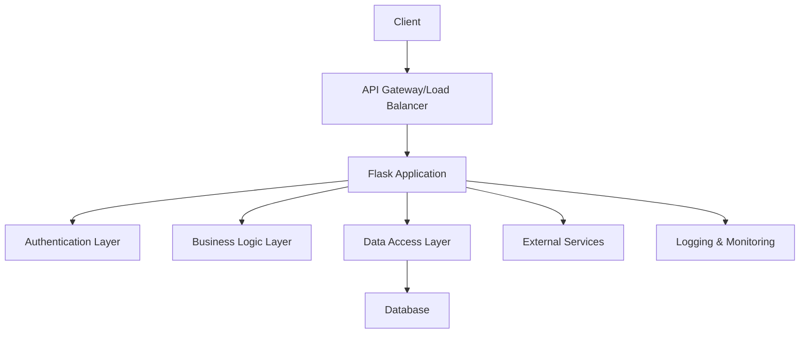

# 设计文档

## 概述

Flask API 模板项目采用分层架构设计，提供一个可扩展、可维护的 API 开发基础框架。项目遵循 Flask 最佳实践，集成常用功能模块，支持多环境部署和 CI/CD 自动化流程。

## 架构

### 整体架构



### 项目结构

```
flask-api-template/
├── app/
│   ├── __init__.py              # Flask 应用工厂
│   ├── config/
│   │   ├── __init__.py
│   │   ├── base.py              # 基础配置
│   │   ├── development.py       # 开发环境配置
│   │   ├── testing.py           # 测试环境配置
│   │   ├── acceptance.py        # 验收环境配置
│   │   └── production.py        # 生产环境配置
│   ├── models/
│   │   ├── __init__.py
│   │   ├── base.py              # 基础模型类
│   │   └── user.py              # 用户模型示例
│   ├── services/
│   │   ├── __init__.py
│   │   ├── auth_service.py      # 认证服务
│   │   └── user_service.py      # 用户服务示例
│   ├── controllers/
│   │   ├── __init__.py
│   │   ├── auth_controller.py   # 认证控制器
│   │   ├── user_controller.py   # 用户控制器示例
│   │   └── health_controller.py # 健康检查控制器
│   ├── middleware/
│   │   ├── __init__.py
│   │   ├── auth_middleware.py   # 认证中间件
│   │   ├── cors_middleware.py   # CORS 中间件
│   │   └── logging_middleware.py # 日志中间件
│   ├── utils/
│   │   ├── __init__.py
│   │   ├── validators.py        # 数据验证工具
│   │   ├── serializers.py       # 数据序列化工具
│   │   └── exceptions.py        # 自定义异常
│   └── extensions.py            # Flask 扩展初始化
├── migrations/                  # 数据库迁移文件
├── tests/
│   ├── __init__.py
│   ├── conftest.py             # pytest 配置
│   ├── unit/                   # 单元测试
│   ├── integration/            # 集成测试
│   └── fixtures/               # 测试数据
├── docker/
│   ├── Dockerfile
│   ├── docker-compose.yml
│   ├── docker-compose.dev.yml
│   └── docker-compose.prod.yml
├── .github/
│   └── workflows/
│       ├── ci.yml              # 持续集成
│       └── cd.yml              # 持续部署
├── scripts/
│   ├── setup.sh               # 项目初始化脚本
│   ├── run_tests.sh           # 测试运行脚本
│   └── deploy.sh              # 部署脚本
├── requirements/
│   ├── base.txt               # 基础依赖
│   ├── development.txt        # 开发依赖
│   ├── testing.txt            # 测试依赖
│   └── production.txt         # 生产依赖
├── .env.example               # 环境变量示例
├── .gitignore
├── README.md
├── run.py                     # 应用入口
└── wsgi.py                    # WSGI 入口
```

## 组件和接口

### 核心组件

#### 1. 应用工厂 (Application Factory)
- **职责**: 创建和配置 Flask 应用实例
- **接口**: `create_app(config_name: str) -> Flask`
- **功能**: 
  - 根据环境加载配置
  - 初始化扩展
  - 注册蓝图
  - 配置中间件

#### 2. 配置管理 (Configuration Management)
- **职责**: 管理不同环境的配置
- **接口**: 配置类继承体系
- **功能**:
  - 基础配置定义
  - 环境特定配置覆盖
  - 敏感信息环境变量管理

#### 3. 认证服务 (Authentication Service)
- **职责**: 处理用户认证和授权
- **接口**: 
  - `login(credentials: dict) -> dict`
  - `verify_token(token: str) -> dict`
  - `refresh_token(refresh_token: str) -> dict`
- **功能**:
  - JWT 令牌生成和验证
  - 用户身份验证
  - 权限检查

#### 4. 数据访问层 (Data Access Layer)
- **职责**: 数据库操作抽象
- **接口**: Repository 模式
- **功能**:
  - ORM 模型定义
  - 数据库迁移管理
  - 查询优化

#### 5. API 文档生成 (API Documentation)
- **职责**: 自动生成 API 文档
- **接口**: Swagger/OpenAPI 集成
- **功能**:
  - 自动文档生成
  - 交互式 API 测试界面
  - 模式验证

### 中间件组件

#### 1. 认证中间件
- 验证请求令牌
- 设置用户上下文
- 处理认证异常

#### 2. CORS 中间件
- 跨域请求处理
- 预检请求支持
- 安全头设置

#### 3. 日志中间件
- 请求/响应日志记录
- 性能监控
- 错误追踪

## 数据模型

### 用户模型 (User Model)
```python
class User(BaseModel):
    id: int
    username: str
    email: str
    password_hash: str
    is_active: bool
    created_at: datetime
    updated_at: datetime
```

### 基础模型 (Base Model)
```python
class BaseModel:
    id: int
    created_at: datetime
    updated_at: datetime
    
    def to_dict(self) -> dict
    def from_dict(cls, data: dict) -> 'BaseModel'
```

## 错误处理

### 异常层次结构
```python
class APIException(Exception):
    status_code: int
    message: str
    
class ValidationError(APIException):
    status_code = 400
    
class AuthenticationError(APIException):
    status_code = 401
    
class AuthorizationError(APIException):
    status_code = 403
    
class NotFoundError(APIException):
    status_code = 404
```

### 全局错误处理器
- 统一错误响应格式
- 错误日志记录
- 开发/生产环境错误信息差异化

## 测试策略

### 测试层次

#### 1. 单元测试
- 服务层逻辑测试
- 工具函数测试
- 模型验证测试
- 覆盖率目标: 90%+

#### 2. 集成测试
- API 端点测试
- 数据库集成测试
- 第三方服务集成测试

#### 3. 端到端测试
- 完整用户流程测试
- 多环境部署验证

### 测试工具
- **pytest**: 测试框架
- **pytest-flask**: Flask 测试支持
- **factory-boy**: 测试数据生成
- **responses**: HTTP 请求模拟
- **coverage**: 代码覆盖率

## 部署和 CI/CD

### 多环境支持

#### 环境配置
- **Development**: 本地开发环境
- **Testing**: 自动化测试环境  
- **Acceptance**: 用户验收测试环境
- **Production**: 生产环境

#### 配置管理
- 环境变量注入
- 配置文件分离
- 敏感信息加密存储

### CI/CD 流程

```mermaid
graph LR
    A[Code Push] --> B[CI Pipeline]
    B --> C[Lint & Format]
    C --> D[Unit Tests]
    D --> E[Integration Tests]
    E --> F[Build Docker Image]
    F --> G[Security Scan]
    G --> H[Deploy to Dev]
    H --> I[E2E Tests]
    I --> J[Deploy to ACC]
    J --> K[Manual Approval]
    K --> L[Deploy to PROD]
```



#### CI 阶段
1. 代码质量检查 (flake8, black, isort)
2. 单元测试执行
3. 集成测试执行
4. Docker 镜像构建
5. 安全漏洞扫描

#### CD 阶段
1. 自动部署到开发环境
2. 端到端测试验证
3. 自动部署到验收环境
4. 人工审批
5. 生产环境部署

### 容器化

#### Docker 配置
- 多阶段构建优化镜像大小
- 非 root 用户运行
- 健康检查配置
- 环境特定的 docker-compose 文件

#### 部署策略
- 蓝绿部署
- 滚动更新
- 回滚机制

## 监控和日志

### 日志策略
- 结构化日志 (JSON 格式)
- 日志级别管理
- 敏感信息脱敏
- 集中化日志收集

### 监控指标
- 应用性能监控 (APM)
- 健康检查端点
- 业务指标监控
- 错误率和响应时间监控

### 告警机制
- 错误率阈值告警
- 响应时间告警
- 资源使用率告警
- 业务指标异常告警