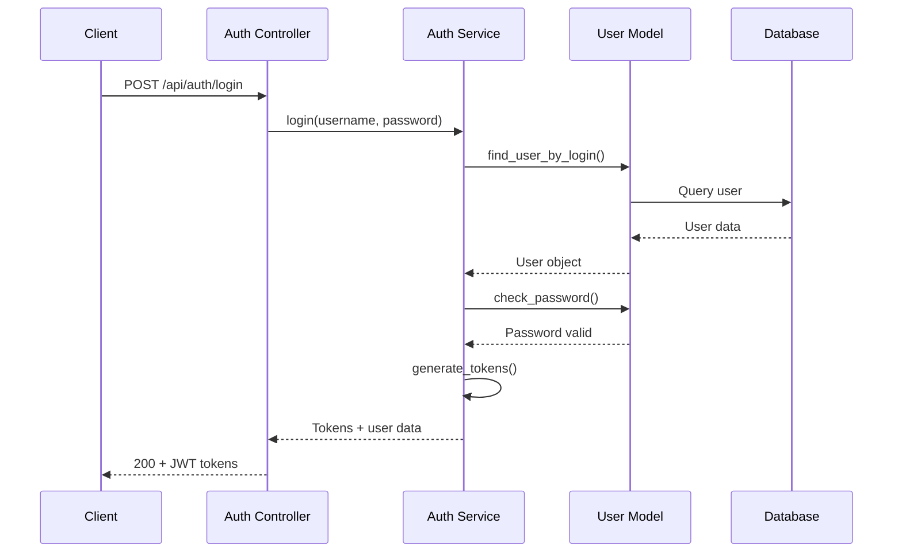
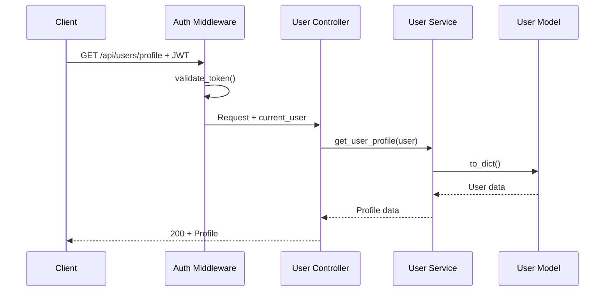

# 🏗️ Flokie Project Overview

Welcome to Flokie! This document provides a comprehensive overview of the project structure, architecture, and key concepts to help you get started quickly.

## 🎯 Project Mission

Flokie aims to provide a production-ready Flask API template that eliminates the repetitive setup work and provides a solid foundation for building scalable, maintainable web applications with modern development practices.

## 🏛️ Architecture Principles

### 1. **Separation of Concerns**
- **Controllers**: Handle HTTP requests and responses
- **Services**: Contain business logic and orchestration
- **Models**: Define data structures and database interactions
- **Schemas**: Handle data validation and serialization

### 2. **Layered Architecture**
```
┌─────────────────────────────────────┐
│           API Layer                 │  ← Flask-RESTX, Controllers
├─────────────────────────────────────┤
│         Business Layer              │  ← Services, Business Logic
├─────────────────────────────────────┤
│          Data Layer                 │  ← Models, Database Access
├─────────────────────────────────────┤
│       Infrastructure Layer          │  ← Database, External Services
└─────────────────────────────────────┘
```

### 3. **Configuration Management**
- Environment-based configuration
- Secure secret management
- Multiple deployment environments

### 4. **Security First**
- JWT-based authentication
- Input validation and sanitization
- Security headers and CORS
- Rate limiting and abuse prevention

## 📁 Project Structure Deep Dive

### Core Application (`app/`)

```
app/
├── __init__.py              # Application factory
├── extensions.py            # Flask extensions initialization
│
├── api/                     # API documentation layer
│   ├── auth_namespace.py    # Authentication API docs
│   ├── user_namespace.py    # User management API docs
│   ├── health_namespace.py  # Health check API docs
│   └── models.py           # API response models
│
├── controllers/             # HTTP request handlers
│   ├── auth_controller.py   # Authentication endpoints
│   ├── user_controller.py   # User management endpoints
│   ├── health_controller.py # Health check endpoints
│   └── doc_controller.py    # Documentation endpoints
│
├── services/                # Business logic layer
│   ├── auth_service.py      # Authentication business logic
│   └── user_service.py      # User management business logic
│
├── models/                  # Database models
│   ├── base.py             # Base model with common functionality
│   └── user.py             # User model with authentication
│
├── schemas/                 # Data validation and serialization
│   ├── auth_schemas.py      # Authentication schemas
│   ├── user_schemas.py      # User management schemas
│   └── common_schemas.py    # Shared validation schemas
│
├── middleware/              # Custom middleware
│   ├── auth_middleware.py   # JWT authentication middleware
│   ├── logging_middleware.py # Request/response logging
│   └── performance_middleware.py # Performance monitoring
│
├── utils/                   # Utility functions
│   ├── exceptions.py        # Custom exception classes
│   ├── error_handlers.py    # Global error handling
│   ├── error_helpers.py     # Error handling utilities
│   ├── validation.py        # Input validation helpers
│   └── logging_config.py    # Logging configuration
│
└── config/                  # Environment configurations
    ├── base.py             # Base configuration
    ├── development.py      # Development settings
    ├── testing.py          # Testing settings
    ├── acceptance.py       # Acceptance testing settings
    └── production.py       # Production settings
```

### Testing Framework (`tests/`)

```
tests/
├── conftest.py             # Pytest configuration and fixtures
├── factories.py            # Test data factories
├── utils.py               # Test utilities and helpers
│
├── unit/                  # Unit tests
│   ├── test_auth_service.py
│   ├── test_user_service.py
│   ├── test_user_model.py
│   └── test_validation_utils.py
│
└── integration/           # Integration tests
    ├── test_auth_api.py
    ├── test_user_api.py
    └── test_database_operations.py
```

### DevOps and Deployment

```
.github/
├── workflows/             # GitHub Actions CI/CD
│   ├── ci.yml            # Continuous Integration
│   ├── cd.yml            # Continuous Deployment
│   ├── security.yml      # Security scanning
│   └── dependency-update.yml # Dependency management
│
docker/
├── Dockerfile            # Multi-stage Docker build
├── docker-compose.dev.yml # Development environment
├── docker-compose.acc.yml # Acceptance environment
└── docker-compose.prod.yml # Production environment

scripts/
├── setup_dev.sh          # Development setup
├── deploy.sh             # Deployment script
├── monitor_deployment.sh # Deployment monitoring
└── rollback.sh           # Rollback script
```

## 🔄 Request Flow

### 1. Authentication Flow


### 2. Authenticated Request Flow


## 🔧 Key Components

### 1. **Application Factory Pattern**
The `create_app()` function in `app/__init__.py` creates and configures Flask app instances:

```python
def create_app(config_name="development"):
    app = Flask(__name__)
    app.config.from_object(config[config_name])

    configure_logging(app)
    init_extensions(app)
    init_middleware(app)
    register_error_handlers(app)
    register_blueprints(app)

    return app
```

### 2. **Extension Management**
Flask extensions are initialized in `app/extensions.py`:

```python
# Initialize extensions
db = SQLAlchemy()
migrate = Migrate()
jwt = JWTManager()
cors = CORS()
api = Api()

def init_extensions(app):
    db.init_app(app)
    migrate.init_app(app, db)
    jwt.init_app(app)
    # ... more extensions
```

### 3. **Service Layer Pattern**
Business logic is encapsulated in service classes:

```python
class AuthService:
    @staticmethod
    def login(username_or_email: str, password: str) -> Dict[str, Any]:
        # Authentication logic
        user = AuthService._find_user_by_login(username_or_email)
        if not user.check_password(password):
            raise InvalidCredentialsError()

        tokens = AuthService._generate_tokens(user)
        return {"user": user.to_dict(), "tokens": tokens}
```

### 4. **Model Base Class**
All models inherit from a base class with common functionality:

```python
class BaseModel(db.Model):
    __abstract__ = True

    id = Column(Integer, primary_key=True)
    created_at = Column(DateTime, default=datetime.utcnow)
    updated_at = Column(DateTime, default=datetime.utcnow, onupdate=datetime.utcnow)

    def save(self):
        db.session.add(self)
        db.session.commit()
        return self
```

## 🔐 Security Features

### 1. **JWT Authentication**
- Access tokens for API authentication
- Refresh tokens for token renewal
- Token blacklisting support
- Configurable token expiration

### 2. **Password Security**
- Bcrypt hashing with salt
- Password strength validation
- Account lockout after failed attempts
- Secure password reset flow

### 3. **Input Validation**
- Request data validation with schemas
- SQL injection prevention
- XSS protection
- CSRF protection

### 4. **Security Headers**
- CORS configuration
- Content Security Policy
- X-Frame-Options
- X-Content-Type-Options

## 🧪 Testing Strategy

### 1. **Test Types**
- **Unit Tests**: Test individual components in isolation
- **Integration Tests**: Test component interactions
- **API Tests**: Test complete request/response cycles
- **Performance Tests**: Load testing and benchmarking

### 2. **Test Structure**
```python
# Unit test example
def test_user_password_hashing(sample_user_data):
    user = User(**sample_user_data)
    assert user.check_password(sample_user_data['password'])
    assert not user.check_password('wrong_password')

# Integration test example
def test_user_registration_flow(client, sample_user_data):
    response = client.post('/api/auth/register', json=sample_user_data)
    assert response.status_code == 201
    assert 'access_token' in response.json['tokens']
```

### 3. **Test Fixtures**
Reusable test data and setup:

```python
@pytest.fixture
def sample_user_data():
    return {
        "username": "testuser",
        "email": "test@example.com",
        "password": "testpassword123",
    }

@pytest.fixture
def created_user(app, sample_user_data):
    with app.app_context():
        user = User(**sample_user_data)
        user.save()
        return user
```

## 🚀 Deployment Architecture

### 1. **Multi-Environment Setup**
- **Development**: Local development with hot reload
- **Testing**: Automated testing environment
- **Acceptance**: User acceptance testing
- **Production**: Live production environment

### 2. **Container Strategy**
```dockerfile
# Multi-stage Docker build
FROM python:3.11-slim as base
# ... base setup

FROM base as development
# ... development dependencies

FROM base as production
# ... production optimizations
```

### 3. **CI/CD Pipeline**
- **Continuous Integration**: Code quality, testing, security
- **Continuous Deployment**: Automated deployment with approvals
- **Blue-Green Deployment**: Zero-downtime deployments
- **Rollback Capability**: Quick rollback to previous versions

## 📊 Monitoring and Observability

### 1. **Health Checks**
- Basic health endpoint
- Detailed system information
- Database connectivity checks
- External service status

### 2. **Logging**
- Structured JSON logging
- Request/response logging
- Error tracking and reporting
- Performance metrics

### 3. **Metrics**
- Response time monitoring
- Error rate tracking
- Throughput measurement
- Resource utilization

## 🔄 Development Workflow

### 1. **Local Development**
```bash
# Setup
make install-dev
make upgrade
make run-dev

# Development cycle
make format      # Code formatting
make lint        # Code linting
make test        # Run tests
make test-coverage # Coverage report
```

### 2. **Feature Development**
1. Create feature branch
2. Implement feature with tests
3. Run quality checks
4. Submit pull request
5. Code review and merge

### 3. **Release Process**
1. Create release branch
2. Update version and changelog
3. Run comprehensive tests
4. Create release tag
5. Deploy to production

## 🎯 Best Practices

### 1. **Code Organization**
- Follow the established directory structure
- Use meaningful names for files and functions
- Keep functions and classes focused and small
- Write comprehensive docstrings

### 2. **Error Handling**
- Use custom exception classes
- Provide meaningful error messages
- Log errors with appropriate levels
- Return consistent error responses

### 3. **Testing**
- Write tests for all new functionality
- Maintain high test coverage (80%+)
- Use descriptive test names
- Test both success and failure cases

### 4. **Security**
- Validate all input data
- Use parameterized queries
- Implement proper authentication
- Follow security best practices

## 📚 Learning Resources

### Flask Ecosystem
- [Flask Documentation](https://flask.palletsprojects.com/)
- [SQLAlchemy Documentation](https://docs.sqlalchemy.org/)
- [Flask-JWT-Extended](https://flask-jwt-extended.readthedocs.io/)
- [Flask-RESTX](https://flask-restx.readthedocs.io/)

### Testing
- [Pytest Documentation](https://docs.pytest.org/)
- [Testing Flask Applications](https://flask.palletsprojects.com/en/2.3.x/testing/)

### Deployment
- [Docker Documentation](https://docs.docker.com/)
- [GitHub Actions](https://docs.github.com/en/actions)

## 🤝 Contributing

Ready to contribute? Check out our [Contributing Guide](../CONTRIBUTING.md) for detailed information on:

- Development setup
- Code standards
- Testing requirements
- Pull request process

---

This overview should give you a solid understanding of Flokie's architecture and design principles. For specific implementation details, refer to the individual documentation files and code comments.
